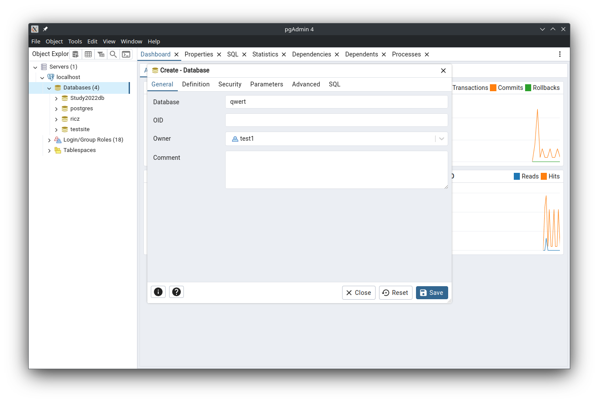

# Подключение PostgreSQL к Django

## Оглавление

  - [Вступление](#вступление)
  - [Установка Postgres-a](#установка-postgres-a)
  - [Конфигурация Postgres после установки](#конфигурация-postgres-после-установки)
  - [Создание Пользователя и Базы](#создание-пользователя-и-базы)
    - [Через `psql`](#через-`psql`)
    - [Через pgAdmin](#через-pgadmin)
  - [Установка Django](#установка-django)
  - [Создаём проект](#создаём-проект)
  - [Создаём приложение](#создаём-приложение)
  - [Определяем Модели в коде (Code First подход)](#определяем-модели-в-коде-(code-first-подход))
  - [Добавляем модели из уже созданных таблиц (Database First подход)](#добавляем-модели-из-уже-созданных-таблиц-(database-first-подход))
  - [Создание представлений](#создание-представлений)
  - [Определяем URL пути](#определяем-url-пути)
  - [Создаем шаблон (страницу)](#создаем-шаблон-(страницу))


## Вступление

На момент написания этого мануала (06.10.24) актуальная версии следующие
- Python 3.12
- PostgreSQL 16.4 (на ней всё тестилось) / 17 (по идее должно заработать)
- Django 5.1.1

Собственно перед началом прочтения стоит убедиться, что на компьютере есть хотя бы python и выход в интернет

Ссылка на репозиторий с работающим примером:  

## Установка Postgres-a

Ссылка на официальные установщики: https://www.postgresql.org/download/

Установка через менеджер пакетов:

Windows (через Chocolatey):
```shell
choco install postgresql
```

macOS:
```bash
brew install postgresql@16 
brew install --cask pgadmin4
```

Ubuntu:
```bash
sudo apt install postgresql pgadmin4
```

## Конфигурация Postgres после установки

Если вы воспользовались официальным установщиком, то можете пропустить этот этап. Он больше подходит для пользователей *nix систем.

Сразу после установки надо проинициализировать БД кластер из под пользователя `postgres`

```bash
sudo -iu postgres
initdb --locale $LANG -E UTF8 -D '/var/lib/postgres/data/'
exit
```

Опции initdb следующие:
- `--locale` - локализация (`$LANG` указана в /etc/locale.conf).
- `-E` кодировка по умолчанию
- `-D` расположение кластера БД по умолчанию

После этого перезапускаем сервис постгри:
```bash
sudo systemctl enable --now postgresql.service
```

## Создание Пользователя и Базы

### Через `psql`

В терминале запускаем `psql` с юзером `postgres`

```bash
$ psql -U postgres
```

- создаем юзера с правом на создание БД
```postgresql
CREATE USER test1 WITH CREATEDB ENCRYPTED PASSWORD 'test1'; 
```
Должны получить ответ `CREATE ROLE`

проверяем что пользователь правильно создался
```bash
postgres=# \du # 
 Role name |                         Attributes                         
-----------+------------------------------------------------------------
 postgres  | Superuser, Create role, Create DB, Replication, Bypass RLS
 test1     | Create DB
```

Создаем Базу к которой мы будем подключаться
```postgresql
CREATE DATABASE testsite OWNER test1;
```

### Через pgAdmin

Переходим на наш сервер и через контекстное меню выбираем `Login/Group Roles -> Create`


В открвшемся окне сначала вводим имя пользователя в поле `Name`.
После этого переходим во вкладку `Definition` и указываем пароль для пользователя.


В конце переходим в вкладку `Privileges` и устанавливаем флажки `Can login` и `Create databases`


Теперь перейдем к созданию Базы. Клацаем правой кнопкой на `Databases` и нажимаем `Create`.



## Установка Django

Для начала создадим виртуальное окружение в котором будет жить наше приложение 
(зачем они нужны можно почитать тут: https://stackoverflow.com/a/41972262)

```bash
# Создает папку с названием test_django_postgres в котором находится нужная версия python
python -m venv test_django_postgres
```

После создания окружения мы должны активировать его

На Windows:
```shell
test_django_postgres\Scripts\activate
```

На *nix системах:
```bash
source test_django_postgres/bin/activate
```

После активации окружения строка в терминале будет выглядеть как-то так

```bash
(test_django_postgres) [~/Projects/test_django_postgres]$ 
```

Теперь установим Django и адаптер для PostgreSQL

```bash
pip install django psycopg
```

Для того чтобы проверить корректность установки можно запустить интерпретатор Python и ввести следующие команды:
```pycon
(test_django_postgres) [~/Projects/test_django_postgres]$ python
>>> import django
>>> print(django.get_version())
5.1 ## версия джанго
```

## Создаём проект

Инициализируем проект в текущей папке:
```bash
django-admin startproject testsite
```

Данная команда создает папку с названием `testsite` в которой находятся настройки нашего инстанса Django.

После этого мы переходим в созданную папку (`cd testsite`) в терминале, либо открываем нашу папку проекта в IDE 
(Pycharm оказался достаточно умен, чтобы автоматически подтянуть конфигурацию запуска при открытии папки `test_django_postgres`).

Теперь подключим наше приложение к нашей базе, для этого откроем файл `testsite/settings.py`
и поменяем наш адаптер с `sqlite` на `postgres`

```python
DATABASES = {
    'default': {
        'ENGINE': 'django.db.backends.postgresql', # меняем адаптер
        'HOST': "localhost", # IP по которому живет наш кластер
        'PORT': 5432, # порт по умолчанию
        'NAME': 'testsite', # Название базы
        'USER': 'test1', # имя созданного пользователя
        'PASSWORD': 'test1', # пароль
    }
}
```

## Создаём приложение
В папке нашего проекта вызываем следующую команду (`todo` - название проекта)
```bash
(test_django_postgres) [~/Projects/test_django_postgres/testsite]$ python manage.py startapp todo  
```

После этого в `settings.py` добавляем наше приложение.
```python
INSTALLED_APPS = [
    # другие приложения
    'todo.apps.TodoConfig',
]
```

## Определяем Модели в коде (Code First подход)

В django уже встроена ORM с помощью которой мы можем определять нужные нам модели прямо в коде.

Например, добавим модель `Task` в файл `todo/model.py`:
```python
import uuid
from django.db import models
from django.contrib.auth.models import User # Модель пользователя, которую предоставляет сам Django

# Все модели которые должны отображаться в БД - наследуют класс Model
class Task(models.Model):
    # Поля таблицы
    id = models.UUIDField(primary_key=True, default=uuid.uuid4, editable=False)
    title = models.CharField(max_length=100)
    completed = models.BooleanField(default=False)
    user = models.ForeignKey(User, on_delete=models.CASCADE)  # Поле которое ссылается на таблицу пользователей

    # здесь определяется мета информация такая как:
    # Индексы, ограничения, название таблицы и т.д.

    # (подробнее тут: https://docs.djangoproject.com/en/5.1/ref/models/options/)
    class Meta:
        db_table_comment = "Todo items"

    def __str__(self):
        return self.title
```

После этого мы создаем новую миграцию нашей БД
```bash
python manage.py makemigrations polls
```

В ответ мы должны получить похожий ответ:
```bash
$ python manage.py makemigrations        
Migrations for 'todo':
  todo/migrations/0001_initial.py
    + Create model Task
```

Проверяем код миграции
```shell
python manage.py sqlmigrate todo 0001
```

```postgresql
-- Ответ
BEGIN;
--
-- Create model Task
--
CREATE TABLE "todo_task" (
  "id" uuid NOT NULL PRIMARY KEY, 
  "title" varchar(100) NOT NULL, 
  "completed" boolean NOT NULL, 
  "user_id" integer NOT NULL
);
COMMENT ON TABLE "todo_task" IS 'Question answers';

ALTER TABLE "todo_task" 
    ADD CONSTRAINT "todo_task_user_id_69f329a5_fk_auth_user_id" FOREIGN KEY ("user_id") 
        REFERENCES "auth_user" ("id") 
        DEFERRABLE INITIALLY DEFERRED;

CREATE INDEX "todo_task_user_id_69f329a5" ON "todo_task" ("user_id");
COMMIT;
```

Теперь применяем нашу миграцию к базе
```bash
python manage.py migrate
```

## Добавляем модели из уже созданных таблиц (Database First подход)
В Django встроена утилита `inspectdb`, которая позволяет создавать модели 
путем прочесыванию существующей базы данных. 
Можно <b>просмотреть</b> результат, выполнив эту команду:
```shell
python manage.py inspectdb
```

Также можно сразу перенаправить сгенерированные модельки с помощью Unix-ового оператора `>` в файл
```shell
python manage.py inspectdb > models.py
```

Эта функция предназначена для сокращения времени переноса моделек, а не для окончательного их создания. 
Более подробную информацию можно найти в документации по inspectdb: https://docs.djangoproject.com/en/5.1/ref/django-admin/#django-admin-inspectdb

После очистки моделей назовите файл `models.py` и поместите его в свое приложение (например `test_django_postgres/testsite/todo/model.py`). 
Затем добавьте приложение в настройку INSTALLED_APPS.

По умолчанию `inspectdb` создает таблицы, которыми ORM не управляем (unmanaged). 
То есть, в классе Meta значение `managed = False`, что указывает Django не управлять созданием, изменением и удалением каждой перенесённой таблицы

В конце концов, для установки таблиц, поставляемых самим django выполните команду
```shell
python manage.py migrate
```

## Создание представлений

В файле todo/views.py добавим представления (по сути обработчики запросов) для отображения, добавления и удаления задач:

```python
from django.shortcuts import render, redirect
from .models import Task

def task_list(request):
    tasks = Task.objects.all()
    return render(request, 'todo/task_list.html', {'tasks': tasks})

def add_task(request):
    if request.method != 'POST':
        return
    
    title = request.POST.get('title')
    Task.objects.create(title=title)
    return redirect('task_list')

def delete_task(request, task_id):
    if request.method != 'DELETE':
        return
    
    task = Task.objects.get(id = task_id)
    task.delete()
    return redirect('task_list')
```

## Определяем URL пути

В файле `todo/urls.py` определите URL для вашего приложения:

```python
from django.urls import path
from . import views

urlpatterns = [
    path('', views.task_list, name='task_list'),
    path('add/', views.add_task, name='add_task'),
    path('delete/<int:task_id>/', views.delete_task, name='delete_task'),
]
```

В файле `todoproject/urls.py` подключите пути приложения `todo`:

```python
from django.contrib import admin
from django.urls import path, include

urlpatterns = [
    path('admin/', admin.site.urls),
    path('', include('todo.urls')),
]
```

## Создаем шаблон (страницу)

В директории todo/templates/todo/ создайте шаблон task_list.html:

```html
<!DOCTYPE html>
<html lang="ru">
<head>
    <meta charset="UTF-8">
    <meta name="viewport" content="width=device-width, initial-scale=1.0">
    <title>Список дел</title>
</head>
<body>
    <h1>Список дел</h1>

    <form action="" method="POST">
        
        <input type="text" name="title" placeholder="Добавить новую задачу">
        <button type="submit">Добавить</button>
    </form>

    <ul>
        
            <li>
                {{ task.title }}
                <a href="">Удалить</a>
            </li>
        
    </ul>
</body>
</html>
```

Теперь запускаем наше приложение
```shell
python manage.py runserver
```